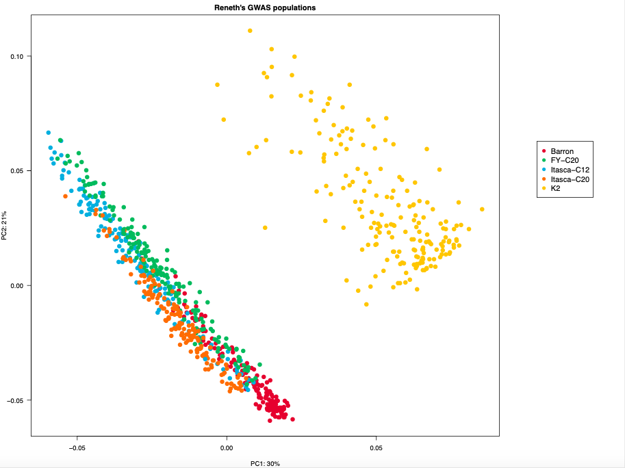

# README for reneth_gwas :dna:
Code relating to Reneth's GWAS project

## Contents
[GWAS samples included in this analysis](#GWAS-samples-included-in-this-analysis)<br>
[Directory setup](#Directory-setup)<br>
[Adapter trimming](#Adapter-trimming)<br>
[Read alignment](#Read-alignment)<br>
[Index your BAM files](#Index-your-BAM-files)<br>
[SNP calling](#SNP-calling)<br>
[Filter SNP calls](#Filter-SNP-calls)<br>
[Principal component analysis](#Principal-component-analysis)<br>
[Create SNP matrix](#Create-SNP-matrix)<br>

## GWAS samples included in this analysis
|Population | Number of individuals |
| :----: | :----: |
| Barron | 168 |
| FY-C20 | 179 |
| Itasca-C12 | 158 |
| Itasca-C20 | 164 |
| K2 | 191 |

## Directory setup
In my initial analysis that I called [**nov_2021_gbs**](https://github.com/MatthewHaas/nov_2021_gbs), I created a plain text file called `nov_2021_gbs_directory_setup.txt`. It is easy enough for me to understand, but I thought the steps might make more sense to everyone else if I put it ito a format that was easier to understand. I think it is particularly important because this was done interactively and involves switching back and forth between the `bash` command line and the `R` statistical environment. Since markdown files (`.md`) enable code blocks, I thought it would help with the interactive steps outlined here.

The data are available here in the following directory:<br>
```bash
/home/jkimball/data_delivery/umgc/2021-q4/211108_A00223_0697_BHNY3NDSX2/Kimball_Project_008/
```

If you want to count the number of `FASTQ` files there are (as a type of pre-check), you can use this command:
```bash
find /home/jkimball/data_delivery/umgc/2021-q4/211108_A00223_0697_BHNY3NDSX2/Kimball_Project_008/*fastq.gz | wc -l 
```

The analysis was carried out in the following working direcotry:
```bash
/scratch.global/haasx092/reneth_gwas
```

The first step is to make a ```CSV``` file containing the full paths to the data.
```bash
# Write the names of gzipped FASTQ files to a CSV file
ls /home/jkimball/data_delivery/umgc/2021-q4/211108_A00223_0697_BHNY3NDSX2/Kimball_Project_008/*fastq.gz > 211117_gbs_filenames.csv
```
The resulting file (`211117_gbs_filenames.csv`) contains _all_ of the `FASTQ` files from the `Kimball_Project_008` data release. This includes Reneth's GWAS populations, the 309 & 310 populations, and Claudia's disease-resistant and -susceptible samples. For purposes of this anaysis, all non-GWAS samples were manually removed and saved as `211222_reneth_gwas_gbs_filenames.csv`.

The next step is to move into the `R` statistical environment to go from file names to a workable `CSV` file that will be used in the next step of the directory structure setup
```R
# Read in data using the data.table package
library(data.table)
fread("211222_reneth_gwas_gbs_filenames.csv", header=F) -> x

# Change the column name from V1 to something more informative (filename)
setnames(x, "filename")
# Add a new column called sample_number. It will initially contain the entire filename, but we will work to retain only the sample number
x[, sample_number := filename]
# Strip off first part of filename until sample number begins (S) but do not include it.
x[, sample_number := sub("^.+[S]", "", sample_number)]
# Strip off end of the filename (after the sample number) ... begins with "_R1" or "_R2"
x[, sample_number := sub("_[R1].+$", "", sample_number)]

# Convert sample numbers to numerical and add leading zeros to all samples (to help with sorting).
x[, sample_number := sprintf("%04d", as.numeric(sample_number))]

# Reorder rows in ascending order
x[order(sample_number)] -> x

# Set column order (my personal preference for sample_number to come first)
setcolorder(x, c("sample_number", "filename")) -> x

# Write output to CSV
write.csv(x, file="211222_reneth_gwas_sample_names_and_numbers.csv", row.names=FALSE, col.names=FALSE, sep=",", quote=FALSE)

# Save table as an R object
save(x, file="211222_reneth_gwas_sample_names_and_numbers.Rdata")
```
After that is done, use the `CSV` file using `bash` to create the directory structure.<br>
**Note:** The `echo $i` part is not really necessary. I just included it to watch the progress.
```bash
cat 211222_reneth_gwas_sample_names_and_numbers.csv | cut -f 1 -d , \
	| while read i; do
	d=Sample_$i
	echo $i
	mkdir -p $d
	done
```
Once that is done, you will probably notice that there is a directory called `Sample_sample_number` which is an artefact of the code. I probably could change the code so that the header isn't interpreted as a sample name, but it's also super easy to just remove it after the code finishes. You can easily remove it with a one-liner:
```bash
rm -rf Sample_sample_number
```
Next, you should make a file with the list of directories. This `txt` file will come in handy for future steps of the GBS analysis.
```bash
ls Sample*/ -d | tr -d / > 211222_reneth_gwas_sample_directory_list.txt
```
This next step is necessary because we are working with paired-end reads. We are doing it because the file `211222_reneth_gwas_sample_names_and_numbers.csv` contains 2 lines per sample (one for the forward read and one for the reverse read).
```bash
awk 'FNR%2' 211222_reneth_gwas_sample_names_and_numbers.csv > 211222_reneth_gwas_file_list_every_other.csv
```
_Make sure you open the resulting file using_ `vi` _to manually remove the header line_. Once that is done, we can make symbolic links (symlinks) to point to the data rather than take up disk space by needlessly duplicating the original files. **Note** that when I analyzed the original dataset, I set `n` to start at 73 and then increased that value by 1 with each iteration of the `while` loop. Since this iteration of the analysis only contains the GWAS samples, there are gaps in the sequence of sample numbers, necessitating a different approach. The approach I used involves extracting the sample number (`Snumber`) from the file name and using that rather than relying on counting iterations through the loop.
```bash
# Make symlinks to GBS data
cat 211222_reneth_gwas_file_list_every_other.csv | cut -f 9 -d / \
	| while read i; do
	STEM=$(echo $i | rev | cut -f 3,4,5,6,7 -d "_" | rev)
	Snumber=$(echo $i | rev | cut -f 3 -d "_"| rev | sed 's/^S//g')
	n=$(printf "%04d\n" $Snumber)
	echo $STEM
	ln -s /home/jkimball/data_delivery/umgc/2021-q4/211108_A00223_0697_BHNY3NDSX2/Kimball_Project_008/${STEM}_R1_001.fastq.gz Sample_$n/Sample_${n}_R1.fq.gz
	ln -s /home/jkimball/data_delivery/umgc/2021-q4/211108_A00223_0697_BHNY3NDSX2/Kimball_Project_008/${STEM}_R2_001.fastq.gz Sample_$n/Sample_${n}_R2.fq.gz
	done
```
In the next step, we will move back to the `R` statistical environment to create a sample key.
```R
# Move back to R
library(data.table)

# Read in data
x <- fread("211222_reneth_gwas_sample_names_and_numbers.csv")

# Change column names
setnames(x, c("sample_number", "sample_name"))

# Add leading zeros
x[, sample_number := sprintf("%04d", as.numeric(sample_number))]
# Add "Sample_" to each sample number
x[, sample_number := paste0("Sample_", sample_number)]

# Remove beginning the beginning part of the filename to remove the part of the path that is no longer necessary to keep
x[, sample_name := sub("^.+Project_008/", "", sample_name)]

# Remove trailing part of filenames (sample names)---ultimately, we only need one line per sample, not two (a consequence of having 2 files per sample for paired-end reads)
x[, sample_name := sub("_[R1].+$", "", sample_name)]
x[, sample_name := sub("_[R2].+$", "", sample_name)]

# Retain unique values only
x <- unique(x)

# Save to CSV
write.csv(x, file="211222_reneth_gwas_sample_key.csv", row.names = FALSE, sep=",", quote=FALSE)
```

## Adapter trimming
The next step in the process is to trim the adapters. Since this is my second time processing this dataset, there is no reason to run the FastQC quality reports.

The script to submit for the adapter trimming is [run_cutadapt.sh](adapter_trimming/run_cutadapt.sh) which depends on/calls the script [cutadapt_wrapper_script.sh](adapter_trimming/cutadapt_wrapper_script.sh). That means they need to be in the same directory in order to work properly.

## Read alignment
After you have trimmed the adapters from the reads, the next step is to align the reads to the genome. We use the Burrows-Wheeler Aligner Maximal Exact Match (BWA-MEM). I decided to speed up the step by running multiple processes in parallel; however, rather than use [GNU Parallel](https://www.gnu.org/software/parallel/), I chose to break the alignment step into 5 separate scripts, segregated by GWAS population membership (Barron, FY-C20, Itasca-C12, Itasca-C20, and K20. This is why there are 5 separate BWA scripts. **Note:** This is only appropriate for the alignment step. Don't try to do the same thing with the SNP-calling step.
1) [run_bwa_Barron.sh](alignment/run_bwa_Barron.sh) which requires [Barron_samples.txt](helper_files/Barron_samples.txt)
2) [run_bwa_FYC20.sh](alignment/run_bwa_FYC20.sh) which requires [FYC20_samples.txt](helper_files/FYC20_samples.txt)
3) [run_bwa_ItascaC12.sh](alignment/run_bwa_ItascaC12.sh) which requires [ItascaC12_samples.txt](helper_files/ItascaC12_samples.txt)
4) [run_bwa_ItascaC20.sh](alignment/run_bwa_ItascaC20.sh) which requires [ItascaC20_samples.txt](helper_files/ItascaC20_samples.txt)
5) [run_bwa_K2.sh](alignment/run_bwa_K2.sh) which requries [K2_samples.txt](helper_files/K2_samples.txt)

## Index your `BAM` files
Once BWA-MEM has completed, you must index the `BAM` files before you can move on to the SNP calling step. Use the script [index_bams.sh](index_bams/index_bams.sh) in order to accomplish this. You also need the file [reneth_gwas_sorted_bam_list.txt](helper_files/reneth_gwas_sorted_bam_list.txt) in order to make it work.

## SNP calling
Now, we proceed to the actual SNP-calling step. Use the script [scythe_mpileup.sh](snp_calling/scythe_mpileup.sh) to do this. Like the alignment step, this will take several hours. One parameter to pay particular attention to is the `-q 20` option. This means that _the minimum mapping quality (MQ) for an alignment to be used_ is 20. This is a measurement of the quality of the read being mapped, not the base at the SNP. You can increase the stringency up to `-q 60`, although `-q 20` is acceptable It's a phred-like score and means that the minimum acceptable probability for a read being correct is 99%. Reads with a lower mapping quality are filtered out. Many (if not most) reads will have an even higher probability of being right.<br>
**Note:** This script uses [GNU Parallel](https://www.gnu.org/software/parallel/), so make sure you cite the program in any manuscript that uses results from these data. You can get the citation info by running `parallel --citation`. (You'll need to run `module load parallel` first.)<br>
**Note:** This took a little more than 2 days to run (2 days, 2 hours, 45 minutes, 15 seconds to be exact). The script is set to 96 hours (4 days) because I previously ran it for 48 hours and it wasn't sufficient so the script timed out.

## Filter SNP calls
Once the SNP calling step is done, you will have a list of 2,183 g-zipped `VCF` files (`.vcf.gz`). There is one file per chromosome/scaffold. Most of these don't contain any SNPs at all, so it isn't worth looking at them. They're also quite small (insignificant) in terms of length of genome sequence. Since we renamed the scaffolds, you no longer need to worry about the original scaffold names deliered to us by Dovetail. You will need to make a file like [vcf_file_list.txt](helper_files/vcf_file_list.txt). I made this manually because it's just a list of the files we actually want to look at (instead of all 2,183). The first one is `211227_snp_calling_results_ZPchr0001.vcf.gz`, the second is called `211227_snp_calling_results_ZPchr0002.vcf.gz`, and so forth all the way through `211227_snp_calling_results_ZPchr0016.vcf.gz`. However, the 17th scaffold (which is important because it is greater than 4 Mb in size contains the Northern Wild Rice _sh4_ ortholog) is called `211227_snp_calling_results_ZPchr0458.vcf.gz`. It was originally Scaffold_453, but we didn't include it in the renaming process because it wasn't among the 15 largest scaffolds.  If we had included it, it would have been ZPchr0017.

Anyway, use the script [filter_with_vcftools.sh](filter_vcfs/filter_with_vcftools.sh) to filter the `VCF` files in order to meet your desired parameters. The way the script is currently written, the parameters are:<br>
* Maximum 10% missing data (`--max-missing 0.90`). _I know this is confusing, but it's correct._
* Bi-allelic sites only (`--min-alleles 2 --max-alleles 2`)
* Minor allele frequency is 0.03 (`--maf 0.03`)
* No indels (`--remove-indels`)
* Minimum depth of 8 reads required at a SNP (`--minDP 8`)

**Note:** So far, most of the software programs we have been using so far have already been installed by the Minnesota Supercomputing Institute (MSI). That's why you can use them by calling `module load` and then referring to them in your code simply by calling the name of the program (e.g., `bwa`, `samtools`, or `bcftools`). [`VCFtools`](https://vcftools.github.io/index.html) is different because I had to install it myself and refer to the place where it is installed in my script (`~/vcftools/bin/vcftools`) rather than just using `vcftools`.

Once the `VCF` files have been filtered according to your desired parameters, you can move on to the next step: putting the SNP calls into a `CSV`-formatted SNP matrix. However, I also like working with [plink](https://zzz.bwh.harvard.edu/plink/index.shtml), especially for performing principal component analysis (PCA). As a first step in that analysis, I merge the 17 filtered `VCF` files into a single merged `VCF` file with [concat_filtered_vcfs.sh](filter_vcfs/concat_filtered_vcfs.sh).

## Principal component analysis
The first step in the pricipal component analysis (PCA) is to run the script [run_plink.sh](plink/run_plink.sh) which will convert the merged `VCF` file into plink format and generate the _eigenvalue_ and _eigenvector_ files that are necessary to make the PCA plots in the R statistical environment. The _eigenvalue_ tells you how much variation is explained by each of the principal components while the _eigenvector_ provides plotting coordinates for each sample on the PCA plot(s). The next step is to run the script [run_plot_plink_pca.sh](plink/run_plot_plink_pca.sh) which requires the R script [plot_plink_pca.R](plink/plot_plink_pca.R) and the `CSV` file [211227_reneth_gwas_sample_key.csv](helper_files/211227_reneth_gwas_sample_key.csv). The path to that `CSV` file is hard-coded into my script so you'll need to change that to reflect where you put the file. You will notice several components to the bash script:<br>
```bash
Rscript plot_plink_pca.R  reneth_gwas_pca.eigenvec reneth_gwas_pca.eigenval 211227_reneth_gwas.pdf 211227_reneth_gwas.Rdata
```
The first part tells bash to use R; the next position (technically the "0" position is the name of the R script you want to use). The following files (positions 1, 2, 3, and 4 or `args[1]`, `args[2]`, `args[3]`, and `args[4]` in the R language) are file names that are inserted into the R script in lieu of hard-coding them into the script itself. This way, you can repeatedly use the same R script.

One of the output files will be a `PDF` file with multiple PCA plots (through the first 8 PCs). We use `PDF` format because it is superior in terms of maintaining resolution. However, you can export to other file types including `PNG`, `JPG`, or `TIF` for presentations, publications, or to use in your own GitHub repositories like the example below (generated in the process of creating this README document).<br>


## Create SNP matrix
The conversion of the `VCF` files to a single tab-separated value (`TSV`) file containing the SNP data is done using `AWK`. The script that does the work is called [normalize.awk](create_snp_matrix/normalize.awk) and is launched using [run_normalize_awk.sh](create_snp_matrix/run_normalize_awk.sh). The `TSV` file is in long format. That means it has one line per SNP + Individual (sample) combination. You'll want to put this into a SNP matrix (`CSV` format) that has one column per sample and one row per SNP. The R script [filter_snps_and_make_wide_format.R](create_snp_matrix/filter_snps_and_make_wide_format.R) will do this. You run the R script using the bash script [run_filter_snps_and_make_wide_format.sh](create_snp_matrix/run_filter_snps_and_make_wide_format.sh). It takes the `TSV` format as input (`args[1]` in R) and outputs a `CSV` file containing the SNP matrix and an `.Rdata` file from the process (`args[2]` ad `args[3]`, respectively).

**Note:** When I initially wrote [filter_snps_and_make_wide_format.R](create_snp_matrix/filter_snps_and_make_wide_format.R), I wrote it so that low-confidence heterozygotes were removed. I did this because SAMtools will call a heterozygote with only a single alternate read to support it. Ideally, you would like to have a little more confidence that it's a true heterozygote and not a sequencing or alignment error. I initially used a minimum depth of 6 (`--minDP 6` in VCFtools) and therefore wanted to use a minimum of 3 alternate alleles (3/6 or 50% of reads at a given SNP); however, rather than removing the SNP entirely, it is just replaced with an "NA" value. I think this is because there are homozygous SNP calls in other individuals at the same locus. So, it becomes a matter of which is worse: some heterozygotes that you might be unsure of or an increase in the amount of missing data. You can change this by removing the `#` symbol in front of `#y[GT==0 | GT == 2 | (GT==1 & DV >= 3)] -> z` if you want to opt for missing data instead.

Congats! You should now have the SNP data you need to do for down-stream analyses (GWAS, pop-gen, etc).:tada:
